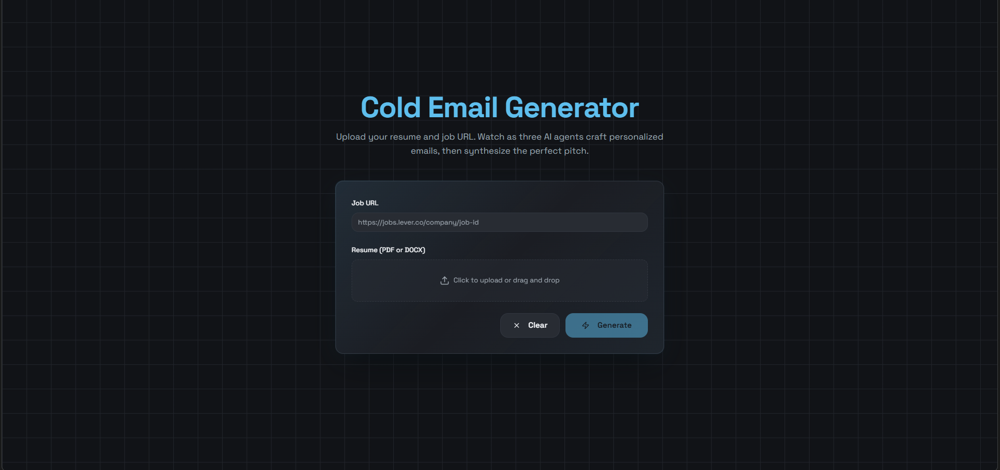

# Cold Email Generator - Architecture Documentation

## System Overview



---

## High-Level Flow

The Cold Email Generator uses a sophisticated multi-agent architecture with fan-out/fan-in pattern:

```
User Input (Resume + Job URL)
           ↓
    Pre-processing Layer
    ├─ Resume Parsing (Landing AI)
    └─ Job Scraping (FireCrawl)
           ↓
    LangGraph State Initialization
           ↓
         START
         / | \
        /  |  \
    Agent1 Agent2 Agent3  (Parallel Execution)
       |    |    |
       |    |    |  → Groq API (Fast Inference)
       |    |    |  → Different Models:
       |    |    |    - Kimi K2
       |    |    |    - Qwen 3 32B
       |    |    |    - OpenAI OSS 120B
        \  |  /
         \ | /
      Aggregator Node
           ↓
    Synthesis with Gemini 2.5 Pro
           ↓
        Response
           ↓
      Final Email + Metadata
```

---

## Component Architecture

### 1. Input Processing Layer

**Resume Parser (`app/services/parser.py`)**
- Accepts PDF/DOCX files (max 5MB)
- Uses Landing AI ADE (Document Extraction) API
- Returns clean, parsed text with metadata
- Handles errors gracefully with fallbacks

**Job Crawler (`app/services/crawler.py`)**
- Scrapes job URLs using FireCrawl
- Extracts job description and metadata
- Returns markdown-formatted content
- Handles JavaScript-heavy SPAs

### 2. State Management (LangGraph)

**EmailState (`app/core/schemas.py`)**
```python
class EmailState(TypedDict):
    # Inputs
    resume_text: str
    job_description: str
    
    # Accumulators (parallel outputs)
    agent_responses: Annotated[List[dict], add]
    
    # Final outputs
    final_email: str
    reasoning: str
    source_breakdown: Dict[str, str]
    
    # Metadata
    job_metadata: Optional[Dict]
```

**Key Design Pattern**: The `add` reducer merges outputs from parallel agents automatically.

### 3. Parallel Agent Layer

**Architecture**: Fan-Out Pattern

Three independent agents run concurrently, each:
- Receives same resume and job description
- Uses different LLM (via Groq)
- Generates unique email draft
- Appends result to `agent_responses` array

**Models Used (via Groq)**:
- **Kimi K2**: `moonshotai/kimi-k2-instruct-0905` (Fast, Creative)
- **Qwen**: `qwen/qwen3-32b` (Balanced, Structured)
- **OpenAI OSS**: `openai/gpt-oss-120b` (Nuanced, Authentic)

**Temperature**: 0.7 (Creative but consistent)

### 4. Aggregation Layer

**Architecture**: Fan-In Pattern + Synthesis

**Aggregator Node** (`app/core/graph.py::aggregator_node`)
- Receives all 3 agent drafts
- Uses Gemini 2.5 Pro for synthesis
- Lower temperature (0.3) for consistency
- Outputs:
  - `final_email`: Best synthesized version
  - `reasoning`: Explanation of choices
  - `source_breakdown`: Which agent contributed which section

### 5. API Layer

**Endpoint**: `POST /generate-email`

**Request Flow**:
```
FastAPI Endpoint
    ↓
Input Validation (Pydantic)
    ↓
Service Calls (Parse + Scrape)
    ↓
LangGraph Invocation
    ↓
Response Serialization
    ↓
JSON Response
```

---

## Data Flow Diagram

```
┌─────────────────────────────────────────────────────────────┐
│                    FastAPI Endpoint                          │
│              POST /generate-email                            │
└────────────────────┬────────────────────────────────────────┘
                     │
                     ↓
          ┌──────────────────────┐
          │  Input Validation    │
          │  - File format       │
          │  - URL format        │
          │  - Size limits       │
          └──────────┬───────────┘
                     │
          ┌──────────┴───────────┐
          ↓                      ↓
    ┌──────────────┐      ┌──────────────┐
    │Resume Parser │      │Job Crawler   │
    │(Landing AI)  │      │(FireCrawl)   │
    └──────┬───────┘      └────────┬─────┘
           │                       │
           └───────────┬───────────┘
                       ↓
          ┌────────────────────────┐
          │  EmailState Init       │
          │  - resume_text        │
          │  - job_description    │
          │  - Empty responses[]  │
          └────────┬───────────────┘
                   ↓
          ┌────────────────────────┐
          │  LangGraph.invoke()    │
          │                        │
          │  ┌──────┬──────┬──────┐│
          │  │Agent1│Agent2│Agent3││ (Parallel)
          │  └──────┴──────┴──────┘│
          │         ↓              │
          │    Aggregator          │
          │         ↓              │
          │  final_email ready     │
          └────────┬───────────────┘
                   ↓
          ┌────────────────────────┐
          │  Response Serialization│
          │  - Validate schemas    │
          │  - Format metadata     │
          └────────┬───────────────┘
                   ↓
          ┌────────────────────────┐
          │  JSON Response (200)   │
          │  - request_id          │
          │  - agent_drafts[]      │
          │  - aggregation         │
          └────────────────────────┘
```

---

## State Transitions

### Initial State
```python
{
    "resume_text": "<parsed resume>",
    "job_description": "<scraped job desc>",
    "job_metadata": {<extracted metadata>},
    "agent_responses": [],
    "final_email": "",
    "reasoning": "",
    "source_breakdown": {}
}
```

### After Parallel Agents (Kimi, Qwen, OpenAI OSS)
```python
{
    "agent_responses": [
        {
            "agent_name": "kimi",
            "model": "moonshotai/kimi-k2-instruct-0905",
            "draft": "<email draft>",
            "status": "complete",
            "metadata": {...},
            "ui_metadata": {...}
        },
        {
            "agent_name": "qwen",
            ...
        },
        {
            "agent_name": "openai_oss",
            ...
        }
    ],
    # Other fields remain from initial state
}
```

### After Aggregator
```python
{
    "final_email": "<synthesized email>",
    "reasoning": "<explanation>",
    "source_breakdown": {
        "subject": "kimi",
        "opening": "kimi",
        "body": "qwen",
        "closing": "openai_oss"
    },
    # agent_responses remain from previous state
}
```

---

## Error Handling Strategy

### Layer 1: Input Validation
- File format validation (PDF/DOCX only)
- File size validation (max 5MB)
- URL validation (HTTP/HTTPS only)
- Returns: 400, 413, 422 status codes

### Layer 2: Service Failures
- Resume parsing timeout → 503
- Job scraping timeout → 503
- API key missing → 400
- Returns: 503, 400 status codes

### Layer 3: LLM Execution
- Model timeout → 500
- Token limit exceeded → 500
- API rate limit → 503
- Returns: 500, 503 status codes

### Layer 4: Response Serialization
- Schema validation failures → 500
- Unexpected exceptions → 500
- Returns: 500 with error_id for tracking

---

## Performance Characteristics

### Processing Timeline

| Stage | Duration | Notes |
|-------|----------|-------|
| Resume Parsing | ~200ms | Landing AI API call |
| Job Scraping | ~800ms | FireCrawl API call |
| Parallel Agents | ~1.5s | All 3 run concurrently (bottleneck: slowest agent) |
| Aggregator | ~2s | Gemini synthesis |
| Response Build | ~100ms | JSON serialization |
| **Total** | **~4.6s** | Average observed time |

### Optimization Insights

1. **Parallelism**: 3 agents run concurrently, providing 2.5-3x speedup vs sequential
2. **Model Selection**: Groq models chosen for inference speed (not just quality)
3. **Streaming**: Could be added at frontend for progressive UI updates
4. **Caching**: Resume parsing could be cached per user session
5. **Batching**: Multiple requests could share LLM connections

---

## API Contract Schema Hierarchy

```
EmailGenerationResponse
├── request_id: str
├── status: "complete" | "processing" | "failed"
├── created_at: datetime
│
├── inputs: InputContext
│   ├── resume_text: str
│   ├── job_description: str
│   ├── job_url: HttpUrl
│   └── job_metadata: JobMetadata
│       ├── title: str
│       ├── company: str
│       └── location: str | null
│
├── agent_drafts: List[AgentDraft] (3 items)
│   ├── agent_name: str
│   ├── model: str
│   ├── draft: str
│   ├── status: str
│   ├── metadata: AgentMetadata
│   │   ├── word_count: int
│   │   ├── generation_time_ms: int
│   │   └── temperature: float
│   └── ui_metadata: UIMetadata
│       ├── color: str (hex)
│       ├── position: "left" | "center" | "right"
│       └── emoji: str
│
└── aggregation: AggregationResult
    ├── final_email: str
    ├── reasoning: str
    ├── source_breakdown: SourceBreakdown
    │   ├── subject: str
    │   ├── opening: str
    │   ├── body: str
    │   └── closing: str
    ├── metadata: AggregationMetadata
    │   ├── word_count: int
    │   ├── generation_time_ms: int
    │   └── quality_score: float (0-10)
    └── ui_metadata: UIMetadata
        └── ...
```

---

## Security Considerations

### Input Security
- File upload size limits (5MB max)
- File type validation (PDF/DOCX only)
- URL scheme validation (HTTP/HTTPS only)
- No code execution from uploads

### API Security
- CORS configured for development (*allowed in POC)
- Rate limiting recommended for production
- No sensitive data in logs
- API keys stored as environment variables
- Request ID tracking for debugging

### External Service Security
- All external calls use HTTPS
- Timeout configurations prevent hangs
- Error messages don't leak sensitive details
- API keys never exposed in responses

---

## Deployment Topology

### Development
```
Local Machine
├── Backend (FastAPI) → localhost:8000
├── Frontend (Next.js) → localhost:3000
└── External APIs
    ├── Groq (LLM inference)
    ├── Gemini (Aggregation)
    ├── FireCrawl (Job scraping)
    └── Landing AI (Resume parsing)
```

### Production (Recommended)
```
Cloud Provider (AWS/GCP/Azure)
├── Backend Container
│   ├── FastAPI App
│   └── LangGraph Runtime
│
├── Frontend CDN/Container
│   └── Next.js Static + SSR
│
├── External APIs (same as above)
│
├── Monitoring
│   └── LangSmith Tracing
│
└── Database (optional)
    └── Request history
```

---

## Scaling Considerations

### Horizontal Scaling
1. **Backend**: Can be load-balanced behind reverse proxy
2. **Stateless Design**: Each request is independent
3. **API Key Rotation**: Use secrets manager for rotation

### Vertical Scaling
1. **Increase timeout limits** for slower networks
2. **Add request queuing** for high traffic
3. **Optimize prompt lengths** to reduce token usage

### Database Addition (Future)
1. Store request history
2. Track user preferences
3. Enable A/B testing
4. Provide analytics

---

## Testing Strategy

### Unit Tests
- Service layer tests (parser, crawler, llm_factory)
- Schema validation tests
- Prompt template tests

### Integration Tests
- Full endpoint tests with mock services
- LangGraph execution tests
- Error handling tests

### E2E Tests
- Real API integration (optional)
- Performance benchmarking
- UI component tests

---

## Monitoring & Observability

### LangSmith Integration
- Trace all LLM calls
- Monitor token usage
- Debug agent behavior
- Track latency per stage

### Logging
- Structured logging with request IDs
- Error tracking with error_ids
- Performance metrics collection

### Metrics to Track
- Requests per minute (RPM)
- Average latency per stage
- Error rate by stage
- Model-specific performance
- Token usage trends

---

## Future Enhancements

1. **Checkpointing**: Add user feedback loop with state persistence
2. **Streaming**: Real-time agent updates to frontend
3. **Multi-Language**: Support for job postings in multiple languages
4. **Email Personalization**: Store user preferences
5. **A/B Testing**: Compare different prompt strategies
6. **Analytics Dashboard**: User-facing insights
7. **Database**: Full request history and analytics
8. **Authentication**: Multi-user support
